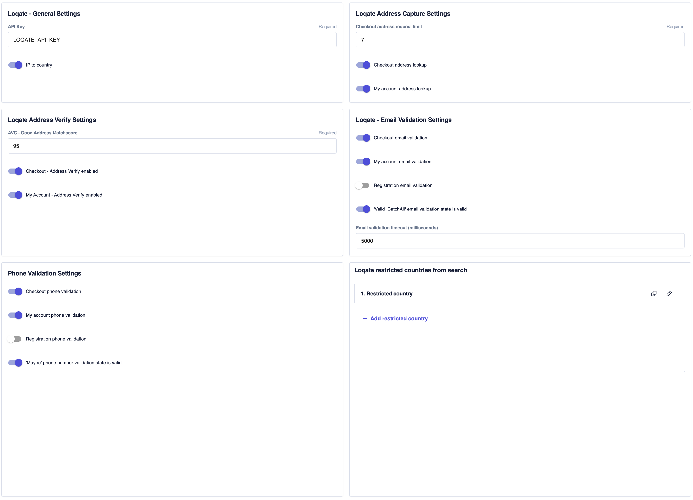

# Studio Settings

Refer to [Commercetools Frontend Studio documentation](https://docs.commercetools.com/frontend-studio/accessing-the-studio) for instructions on how to access the studio.

The following settings are configurable in the `Project settings`, found in the [`projectConfiguration.json`](packages/poc/backend/commerce-commercetools/schemas/projectConfiguration.json) file:

| Name                                              | Env Variable                                 | Description                                                                          |
| ------------------------------------------------- | -------------------------------------------- | ------------------------------------------------------------------------------------ |
| `Project Key`                                     | LOQATE_API_KEY                               | The API key used to authorize requests against Loqate.                               |
| `IP to Country`                                   | LOQATE_IP_TO_COUNTRY_ENABLED                 | Toggles IP to country functionality on or off.                                       |
| `Restricted Countries`                            | RESTRICTED_COUNTRIES                         | A list of restricted country ISO2 codes.                                             |
| `Checkout Address Request Limit`                  | CHECKOUT_ADDRESS_REQUEST_LIMIT               | Debounce time for address capture requests.                                          |
| `Checkout Address Lookup`                         | LOQATE_ADDRESS_LOOKUP_CHECKOUT               | Toggle for address lookup during checkout.                                           |
| `My Account Address Lookup`                       | LOQATE_ADDRESS_LOOKUP_MY_ACCOUNT             | Toggle for address lookup on the "My Account" page.                                  |
| `Checkout - Address Verify`                       | LOQATE_ADDRESS_VERIFICATION_CHECKOUT         | Toggle for address verification during checkout.                                     |
| `My Account - Address Verify`                     | LOQATE_ADDRESS_VERIFICATION_MY_ACCOUNT       | Toggle for address verification on the "My Account" page.                            |
| `Checkout Email Validation`                       | LOQATE_EMAIL_VALIDATION_CHECKOUT             | Toggle for email validation during checkout.                                         |
| `My Account Email Validation`                     | LOQATE_EMAIL_VALIDATION_MY_ACCOUNT           | Toggle for email validation on the "My Account" page.                                |
| `Checkout Phone Validation`                       | LOQATE_PHONE_VALIDATION_CHECKOUT             | Toggle for phone validation during checkout.                                         |
| `My Account Phone Validation`                     | LOQATE_PHONE_VALIDATION_MY_ACCOUNT           | Toggle for phone validation on the "My Account" page.                                |
| `Registration Phone Validation`                   | LOQATE_PHONE_VALIDATION_REGISTRATION         | Toggle for phone validation during registration.                                     |
| `Maybe' Phone Number Validation State is Valid`   | LOQATE_INCLUDE_MAYBE_PHONE_NUMBERS           | Determines whether the `Maybe` phone number validation state is treated as valid.    |
| `Valid_CatchAll' Email Validation State is Valid` | LOQATE_INCLUDE_VALID_CATCHALL_EMAILS         | Determines whether `Valid_CatchAll` email validation responses are considered valid. |
| `Email Validation Timeout (milliseconds)`         | LOQATE_EMAIL_VALIDATION_TIMEOUT_MILLISECONDS | Timeout duration for email validation requests.                                      |
| `AVC - Good Address Matchscore`                   | LOQATE_AVC                                   | The minimum matchscore threshold for an address to be considered `Good`.             |
